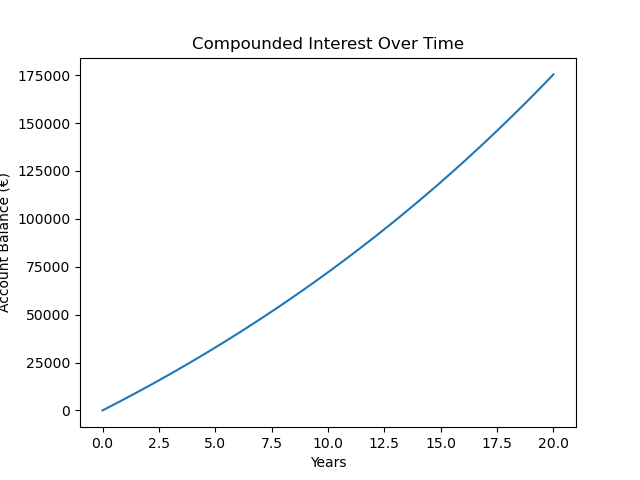
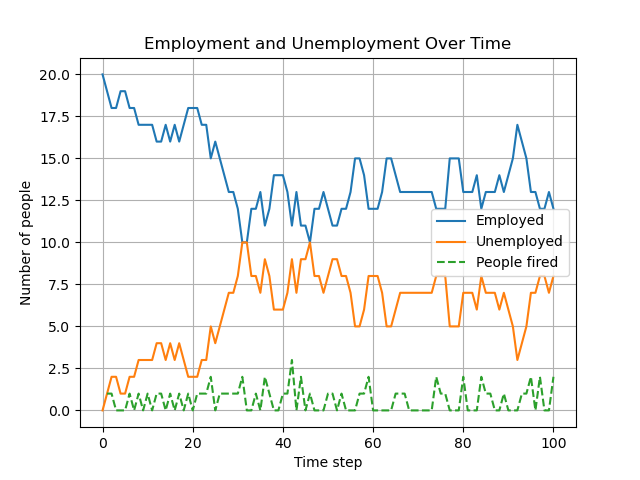
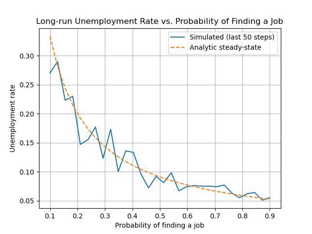
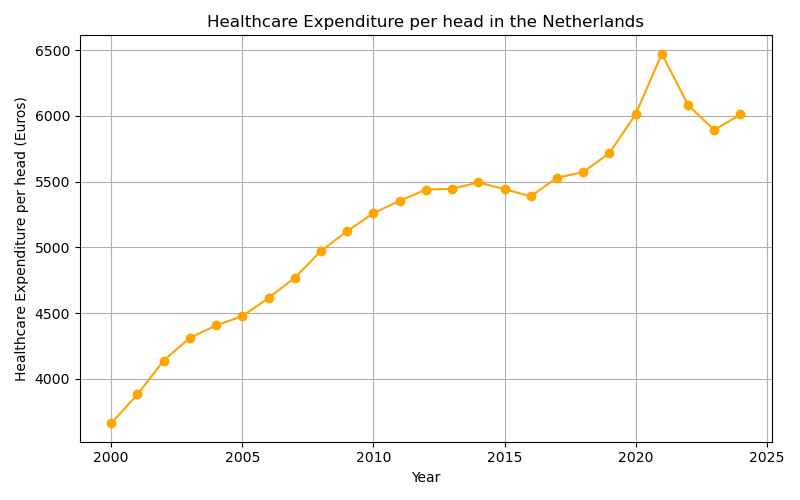
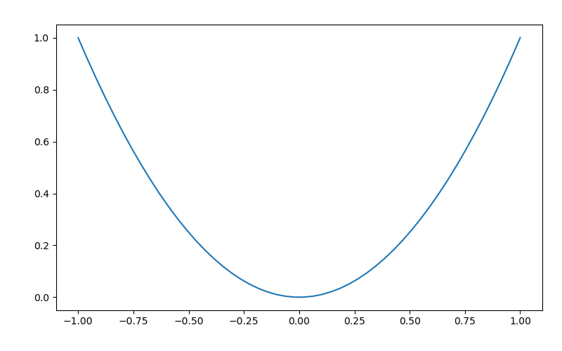
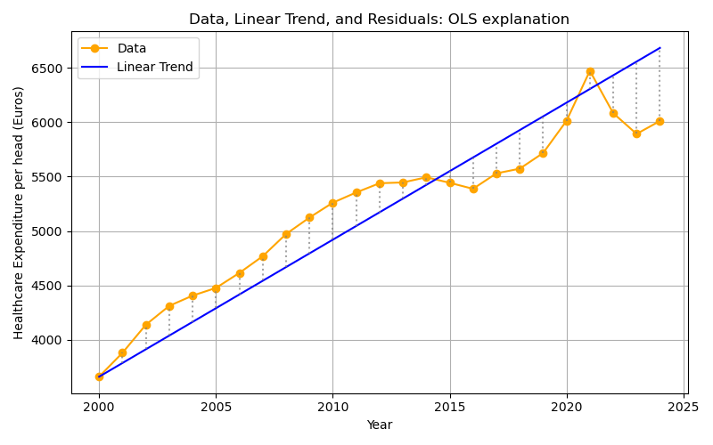
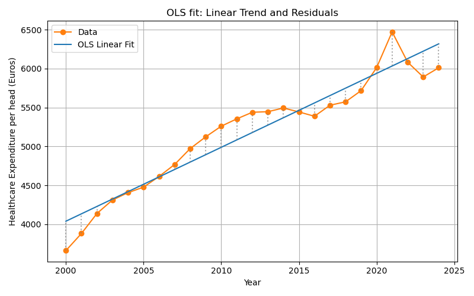
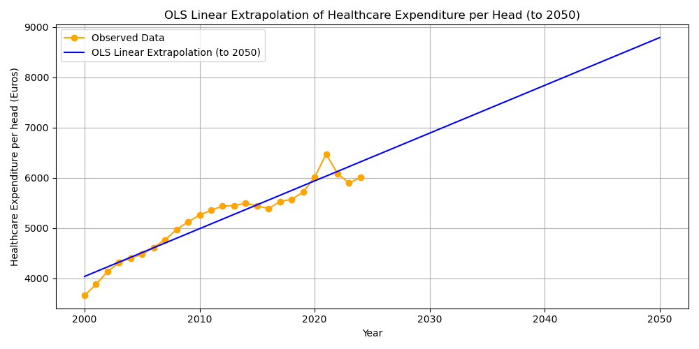
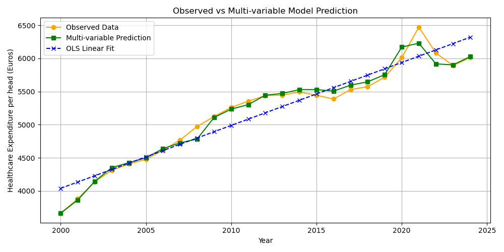
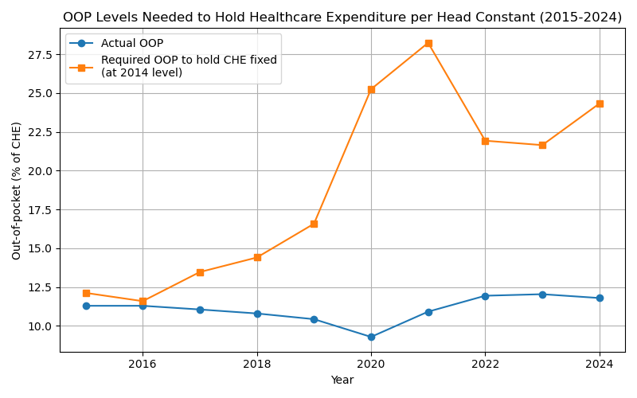

#+SETUPFILE: ./org-html-themes/org/theme-readtheorg.setup
#+TITLE: Lectures Methods: Python programming for economists
#+AUTHOR: Jan Boone
#+property: header-args  :session lectures :kernel python3 :async yes
#+OPTIONS: toc:nil num:nil html-style:nil
#+auto_tangle: t

#+LANGUAGE: en
#+INFOJS_OPT: view:showall toc:t ltoc:t mouse:underline path:http://orgmode.org/org-info.js
#+LaTeX_CLASS: article-12
#+LATEX_HEADER: \renewcommand{\floatpagefraction}{.8} %% avoids figures getting their own page
#+latex_header: \input{author.tex}
#+latex_engraved_theme: t
#+EXPORT_SELECT_TAGS: export
#+EXPORT_EXCLUDE_TAGS: noexport
#+OPTIONS: toc:nil timestamp:nil num:2 ':t \n:nil @:t ::t |:t ^:{} _:{} *:t TeX:t LaTeX:t
#+HTML_HEAD: <link rel="stylesheet" href="./css/Latex.css">
#+HTML_HEAD: <link rel="stylesheet" href="https://latex.now.sh/prism/prism.css">
#+HTML_HEAD: 

#+HTML_HEAD: <meta name="viewport" content="width=device-width, initial-scale=1.0" />
#+HTML_HEAD: 

#+BEGIN_EXPORT html
<main>
#+END_EXPORT

* Introduction
:PROPERTIES:
:UNNUMBERED: t
:END:

The idea of these lectures is to combine Python programing with economics. The overall goal is for you to acquire the skills to transfer information/knowledge to others (say, future colleagues) using more instruments than just written text.

Hence, we teach you how to use Python (learn the syntax) to solve economic models and then to create interactive apps to explain the intuition of these models. To explain how you can use these skills, we present all Python concepts in an economic context and show you how interactive elements can help the reader/user to gain the underlying economic intuition.

We start simple in lecture 1 with compound interest. Later you will learn how to solve for the equilibrium of models and do simulations. At the end you can solve differential equations.

The structure of each lecture is the same:
- explain the economic context
- show the intuition using an interactive notebook/app
- explain the python code that creates the app
- have some review questions

Our advice is to have this website open to read the information and next to it have your [[https://marimo.io/][marimo]] notebook to make notes and program the interactive elements for the app. Most apps below are programed with [[https://streamlit.io/][streamlit]] which is very similar to =marimo=.

* Lecture 1: The Power of Compounded Interest and Employment Dynamics
:PROPERTIES:
:HTML_CONTAINER_CLASS: section
:END:

In this lecture we program two simple apps. First, we model compounded interest and then we model employment dynamics in a labor market. Along the way you learn the following Python concepts:
- variables
- lists and how to append lists
- for-loop
- =numpy= and =numpy= arrays, generating random numbers (e.g. from a binomial distribution)
- =matplotlib= to create figures
- parameter sweep 

** Apps

This lecture introduces Python through two economic models:

1. The Power of Compounded Interest: We model the growth of a bank account with regular deposits and compounded interest. This is analogous to the "falling coin" example in physics, but here we use an economic scenario.
2. Modeling Employment and Unemployment: We model the employment status of 20 people in a village. Each person can be either employed or unemployed. At each time step, an employed person can lose their job (become unemployed) with a certain probability, and an unemployed person can find a job (become employed) with another probability.

You can experiment with both models in the interactive demos below.

*** Compounded interest
:PROPERTIES:
:HTML_CONTAINER_CLASS: section
:END:

The following app illustrates how a lower monthly deposit can be "compensated" by a higher interest rate and lead to a higher final balance then a high monthly deposit with lower interest rate. Adjust the sliders by setting a relatively high deposit and low interest rate in scenario 1 and low deposit with high interest rate in scenario 2. Click the 'Calculate' button to see how the balance develops over time in each scenario.

#+BEGIN_EXPORT html
<iframe
  src="https://lecture1compoundinterest.streamlit.app/?embed=true"
  allow="fullscreen">
</iframe>

  

    If the app does not load,
    <a href="https://lecture1compoundinterest.streamlit.app/?embed=true" target="_blank">
      open it in a new tab
    </a>.
  

#+END_EXPORT

*** Employment dynamics
:PROPERTIES:
:HTML_CONTAINER_CLASS: section
:END:

The following app illustrates how employment/unemployment evolves in a small town with 20 inhabitants. We start with full employment. With the sliders you can set the probability that an employee is fired (say, because her firm goes bankrupt) and the probability that an unemployed person is hired. Select the number of periods for which you want to run the simulation and click the 'Run Simulation' button.

The second app illustrates a parameter sweep. This shows how sensitive an outcome is to the parameter value. In this case, we want to analyze the sensitivity of the long run unemployment level to the probability of finding a job. As this is a simple simulation model, we can actually derive the long run unemployment level analytically. The figure compares the simulated long run unemployment level with the analytic solution. For the probability of being fired chosen in the first app, clicking 'Sweep Parameter' shows long run unemployment for different values of $p_{hired}$.

#+BEGIN_EXPORT html
<iframe
  src="https://lecture1employmentdynamics.streamlit.app/?embed=true"
  allow="fullscreen">
</iframe>

  

    If the app does not load,
    <a href="https://lecture1employmentdynamics.streamlit.app/?embed=true" target="_blank">
      open it in a new tab
    </a>.
  

#+END_EXPORT

** Python Code Explanation

In this section we explain the Python code for the model itself, not yet for the interactive elements. In a next lecture we explain how to create sliders for parameters.

*** Compounded Interest Model

Let's see how you can model the growth of a bank account with regular deposits and compounded interest in Python.

If you want to learn to program in Python, our advice is that you type the code below in your =marimo= notebook and run it. Then start to "play with it": change things, experiment with the code. You cannot break anything and (mis)typing code, getting errors, using google or an LLM to understand the errors and change the code: this is how you learn to program. Just glancing over the code below and thinking you "understand things" is a waste of your time. 

**** 1. Set the parameters

We start by defining the monthly deposit, the monthly interest rate, and the number of months. Here, we use euros as the currency.

We do this by defining variables, like ~deposit~, and give these a value:

#+begin_src jupyter-python
deposit = 500      # euros per month
rate = 0.003        # monthly interest rate (0.3%)
months = 20 * 12    # 20 years
#+end_src

#+RESULTS:

**** 2. Initialize the balance and create an empty list

We start with a balance of zero. We also create an empty =list= called ~balances~ to store the account balance at each month.

In Python, a =list= is a data structure that can hold an ordered collection of items. In Python a list is denoted by brackets ~[]~. "Ordered" in the sense that the first element refers to the start balance, the second element to the balance one month after that etc.
We use a list here so we can keep track of the balance after each month, which is useful for plotting the results later.

#+begin_src jupyter-python
balance = 0
balances = []
#+end_src

#+RESULTS:

**** 3. Simulate the account growth with a for loop

We use a =for= loop to repeat the same calculation for each month.
In each iteration, we first store the current balance in the list, then update the balance by adding the deposit and applying the interest.

- ~for m in range(months + 1):~
  This loop runs once for each month, including month 0.
- ~balances.append(balance)~
  This adds the current balance to the end of the ~balances~ list.

#+begin_src jupyter-python
for m in range(months + 1):
    balances.append(balance)
    balance = balance * (1 + rate) + deposit
#+end_src

#+RESULTS:

**** 4. Plot the results

We use =matplotlib= to visualize the growth of the account over time.

- for the code cell below we need to import two libraries =matplotlib,numpy= that we use in the code. Staments like ~import numpy as np~ mean that we can access =numpy= functions like ~arange~ by writing ~np.arange~
- the ~np.arange~ function takes three arguments: begin point, end point and step size; the end point is not included. In your =marimo= notebook: try different arguments in this function and see what the outcome is.
- ~years = np.arange(months + 1) / 12~
  This creates a list of time points in years, matching the number of balances.
- ~plt.plot(years, balances)~
  The ~plot~ function takes two lists or arrays of equal length:
  the first for the x-axis, years, and the second for the y-axis, balances in euros.
- By looking at the figure, you can probably infer what the functions ~plt.xlabel, plt.ylabel, plt.title~ do.

#+begin_src jupyter-python :file ./figures/compounded_interest.png
import matplotlib.pyplot as plt
import numpy as np

years = np.arange(months + 1) / 12
plt.plot(years, balances)
plt.xlabel("Years")
plt.ylabel("Account Balance (€)")
plt.title("Compounded Interest Over Time");
#+end_src

#+RESULTS:

Use an LLM to figure out what the following Python code does:

#+begin_src jupyter-python
periods = months + 1
factors = np.power(1 + rate, np.arange(periods))
balances = deposit * np.cumsum(factors)
#+end_src

#+RESULTS:

-----

*** Employment Dynamics Model

Let's break down the Python code for simulating employment and unemployment in a small village.

**** 1. Set the parameters

We define the number of people, the probabilities, and the number of time steps. Copy this into your =marimo= notebook and see what happens if you change the value of the variable ~n_people~ to, say, 1000.

#+begin_src jupyter-python
n_people = 20
p_fired = 0.05   # probability an employed person is fired each step
p_hired = 0.10   # probability an unemployed person finds a job each step
n_steps = 100
#+end_src

#+RESULTS:

**** 2. Initialize the state

We start with everyone employed.
We create lists to store the number of employed and unemployed people at each time step.

#+begin_src jupyter-python
employed = n_people
unemployed = 0
employed_hist = [employed]
unemployed_hist = [unemployed]
#+end_src

#+RESULTS:

**** 3. Simulate the process with a for loop

For each time step:
- For each employed person, we draw from a Bernoulli distribution to see whether they are fired. A Bernoulli distribution is equivalent to a binomial distribution with $n=1$.
- For each unemployed person, we draw from a Bernoulli distribution to see whether they are hired.
- We update the counts and store them in the lists.

We use ~np.random.binomial(n, p)~ to draw the number of successes, fired or hired, out of ~n~ people, each with probability ~p~.

~employed = employed - fired + hired~ means that the new value of ~employed~ (left hand side) equals the previous value of this variable minus the people that are fired plus the hires this period.

Above we have already seen the use of ~append~ to "add" a value to a list or an array.

#+begin_src jupyter-python
for t in range(n_steps):
    fired = np.random.binomial(employed, p_fired)
    hired = np.random.binomial(unemployed, p_hired)
    employed = employed - fired + hired
    unemployed = n_people - employed
    employed_hist.append(employed)
    unemployed_hist.append(unemployed)
#+end_src

#+RESULTS:

**** 4. Plot the results

We use =matplotlib= to plot the number of employed and unemployed people over time.

When you add a label to a ~plt.plot~ or ~plt.scatter~ command with ~label="Employed"~, you need to specify ~plt.legend()~ to add the legend to the figure. With the latter function you can also determine where the legend will be added in the figure. Google or use an LLM to find out how that works. If you do not specify a position, =matplotlib= will try to find the best placement itself.

#+begin_src jupyter-python :file ./figures/employed_unemployed.png
steps = np.arange(n_steps + 1)
plt.plot(steps, employed_hist, label="Employed")
plt.plot(steps, unemployed_hist, label="Unemployed")
plt.xlabel("Time step")
plt.ylabel("Number of people")
plt.title("Employment and Unemployment Over Time")
plt.legend()
plt.grid(True)
#+end_src

#+RESULTS:

***** Summary of what the code does

- *Step 1:* Set the parameters for the simulation.
- *Step 2:* Initialize the state and lists to store the results.
- *Step 3:* Use a for loop to simulate each time step, updating the state using random draws from the binomial distribution.
- *Step 4:* Plot the results to visualize how employment and unemployment evolve over time.

This model demonstrates how randomness and probabilities can be used to simulate real-world economic processes in =Python=.

-----

*** Parameter Sweep: Long-run Unemployment Rate

A question when doing simulations is: how sensitive are the simulation results to the parameter values chosen. One way to get an idea of this sensitivity is to run the simulations for a sweep of parameter values. We illustrate this by analyzing long run or steady state unemployment. In the simulations we program long run unemployment as follows:
- we run the simulations for 200 periods; this ensures that the effect of the initial unemployment level disappears
- then we consider only the final 50 periods (that is period 150-200)
- and we take the average unemployment level over these 50 periods; because hiring and firing are stochastic processes, the outcome in one particular period is random. By taking the average over 50 periods, we average out these per period stochastic outcomes.

As the model is quite simple, we can actually derive the steady state unemployment level analytically. If you do not quite see how we got this expression, you can watch the following derivation:

#+BEGIN_EXPORT html

  <video style="width:600px;" controls>
    <source src="./manim/media/videos/steady_state_unemployment/2160p60/DerivationScene.mp4" type="video/mp4">
  </video>

#+END_EXPORT

**** 5. Sweep code

Two points on the code:
- here we use ~np.linspace~ instead of ~np.arange~. Both functions achieve the same result with slightly different syntax. Google "numpy linspace" for details.
- in a later lecture we will look into indexing of lists and arrays. For now: ~unemployment_hist[-50:]~ refers to the final 50 entries in list/array ~unemployment_hist~.

#+begin_src jupyter-python
n_people = 20
n_steps = 200
p_fired = 0.05  # fixed probability of being fired
sweep_p_hired = np.linspace(0.1, 0.9, 30)
avg_unemp = []
analytic_unemp = []

for p_h in sweep_p_hired:
    employed = n_people
    unemployed = 0
    unemployed_hist = [unemployed]
    for t in range(n_steps):
        fired = np.random.binomial(employed, p_fired)
        hired = np.random.binomial(unemployed, p_h)
        employed = employed - fired + hired
        unemployed = n_people - employed
        unemployed_hist.append(unemployed)
    # Average unemployment rate over last 50 steps
    avg_unemp.append(np.mean(unemployed_hist[-50:]) / n_people)
    # Analytic steady-state
    u_analytic = p_fired / (p_fired + p_h)
    analytic_unemp.append(u_analytic)
#+end_src

#+RESULTS:

**** 6. Plotting the sweep results

#+begin_src jupyter-python :file ./figures/steady_state_unemployment.png
plt.plot(sweep_p_hired, avg_unemp, label="Simulated (last 50 steps)")
plt.plot(sweep_p_hired, analytic_unemp, '--', label="Analytic steady-state")
plt.xlabel("Probability of finding a job")
plt.ylabel("Unemployment rate")
plt.title("Long-run Unemployment Rate vs. Probability of Finding a Job")
plt.legend()
plt.grid(True)
plt.show()
#+end_src

#+RESULTS:

***** Summary of what the code does

- *Step 1-4:* Simulate the employment dynamics as before.
- *Step 5:* For a range of probabilities of finding a job, run the simulation and compute the average unemployment rate in the long run. Also compute the analytic steady-state unemployment rate:

$$
u = \frac{p_{\text{fired}}}{p_{\text{fired}} + p_{\text{hired}}}
$$

- *Step 6:* Plot both the simulated and analytic results to compare.

Sweeping parameters is a powerful way to explore how a model behaves as you change its assumptions.

*** streamlit :noexport:

#+begin_src python :tangle ./lecture1/app1/app.py
import streamlit as st
import numpy as np
import matplotlib.pyplot as plt

st.set_page_config(page_title="Lecture 1", layout="wide")

st.title("Compounded Interest")

st.header("Interactive: Compounded Interest Scenarios")
st.markdown("#### Scenario 1: High deposit, lower interest rate")
deposit1 = st.slider("Monthly deposit (Scenario 1)", min_value=50, max_value=2000, value=500, step=50, key="deposit1")
rate1 = st.slider("Monthly interest rate (%) (Scenario 1)", min_value=0.0, max_value=2.0, value=0.3, step=0.01, key="rate1") / 100

st.markdown("#### Scenario 2: Low deposit, higher interest rate")
deposit2 = st.slider("Monthly deposit (Scenario 2)", min_value=10, max_value=1000, value=100, step=10, key="deposit2")
rate2 = st.slider("Monthly interest rate (%) (Scenario 2)", min_value=0.0, max_value=2.0, value=1.0, step=0.01, key="rate2") / 100

calculate = st.button("Calculate", key="calculate_button")

if calculate: 
    months = 20 * 12  # 20 years
    balances1 = []
    balances2 = []
    b1 = 0
    b2 = 0
    for m in range(months + 1):
        balances1.append(b1)
        balances2.append(b2)
        b1 = b1 * (1 + rate1) + deposit1
        b2 = b2 * (1 + rate2) + deposit2

    years = np.arange(months + 1) / 12

    fig, ax = plt.subplots()
    ax.plot(years, balances1, label=f"Scenario 1: €{deposit1}/mo, {rate1*100:.2f}%/mo")
    ax.plot(years, balances2, label=f"Scenario 2: €{deposit2}/mo, {rate2*100:.2f}%/mo")
    ax.set_xlabel("Years")
    ax.set_ylabel("Account Balance (€)")
    ax.set_title("Compounded Interest: Two Scenarios")
    ax.legend()
    ax.grid(True)
    st.pyplot(fig)

    st.markdown("""
**Try adjusting the sliders above and press "Calculate"!**  
Notice how even a small increase in the interest rate can have a dramatic effect on the final balance, especially over long periods. This is the "power of compounded interest."
""")
else:
    st.info('Adjust the sliders and press "Calculate" to see the results.')
#+end_src

#+begin_src python :tangle ./lecture1/app2/app.py
import streamlit as st
import numpy as np
import matplotlib.pyplot as plt

st.set_page_config(page_title="Lecture 1", layout="wide")

st.header("Interactive: Employment Dynamics Simulation")
st.markdown("Set the probabilities and run the simulation:")

p_fired = st.slider("Probability of being fired (per employed person, per step)", min_value=0.0, max_value=0.5, value=0.05, step=0.01)
p_hired = st.slider("Probability of finding a job (per unemployed person, per step)", min_value=0.0, max_value=0.5, value=0.10, step=0.01)
n_people = 20
n_steps = st.slider("Number of time steps", min_value=20, max_value=200, value=100, step=10)

run_sim = st.button("Run Simulation", key="run_employment_sim")

if run_sim:
    employed = n_people
    unemployed = 0
    employed_hist = [employed]
    unemployed_hist = [unemployed]

    for t in range(n_steps):
        fired = np.random.binomial(employed, p_fired)
        hired = np.random.binomial(unemployed, p_hired)
        employed = employed - fired + hired
        unemployed = n_people - employed
        employed_hist.append(employed)
        unemployed_hist.append(unemployed)

    steps = np.arange(n_steps + 1)

    fig, ax = plt.subplots()
    ax.plot(steps, employed_hist, label="Employed")
    ax.plot(steps, unemployed_hist, label="Unemployed")
    ax.set_xlabel("Time step")
    ax.set_ylabel("Number of people")
    ax.set_title("Employment and Unemployment Over Time")
    ax.legend()
    ax.grid(True)
    st.pyplot(fig)

    st.markdown("""
**Try changing the probabilities and rerun the simulation!**  
Notice how the number of employed and unemployed people fluctuates over time, depending on the probabilities.
""")
else:
    st.info('Set the probabilities and press "Run Simulation" to see the results.')

st.divider()

st.header("Parameter Sweep: Long-run Unemployment Rate")
st.markdown(
        """
Explore how the long-run unemployment rate depends on the probability of finding a job.

- The probability of being fired is set by the slider above.
- The probability of finding a job is swept from 0.1 to 0.9.
- For each value, we simulate the process and compute the average unemployment rate in the long run (last 50 steps).
- The analytic steady-state unemployment rate $u$ solves:  
  $$
  p_{\\text{fired}} \\cdot (1-u) = p_{\\text{hired}} \\cdot u
  $$
  so
  $$
  u = \\frac{p_{\\text{fired}}}{p_{\\text{fired}} + p_{\\text{hired}}}
  $$
"""
    )

sweep_btn = st.button("Sweep Parameter", key="sweep_button")
if sweep_btn:
    n_people = 20
    n_steps = 200
    sweep_p_hired = np.linspace(0.1, 0.9, 30)
    avg_unemp = []
    analytic_unemp = []
    for p_h in sweep_p_hired:
        employed = n_people
        unemployed = 0
        unemployed_hist = [unemployed]
        for t in range(n_steps):
            fired = np.random.binomial(employed, p_fired)
            hired = np.random.binomial(unemployed, p_h)
            employed = employed - fired + hired
            unemployed = n_people - employed
            unemployed_hist.append(unemployed)
        # Average unemployment rate over last 50 steps
        avg_unemp.append(np.mean(unemployed_hist[-50:]) / n_people)
        # Analytic steady-state
        u_analytic = p_fired / (p_fired + p_h)
        analytic_unemp.append(u_analytic)

    fig, ax = plt.subplots()
    ax.plot(sweep_p_hired, avg_unemp, label="Simulated (last 50 steps)")
    ax.plot(sweep_p_hired, analytic_unemp, '--', label="Analytic steady-state")
    ax.set_xlabel("Probability of finding a job")
    ax.set_ylabel("Unemployment rate")
    ax.set_title("Long-run Unemployment Rate vs. Probability of Finding a Job")
    ax.legend()
    ax.grid(True)
    st.pyplot(fig)

    st.markdown(
            """
The plot shows the average unemployment rate (from simulation) and the analytic steady-state value as a function of the probability of finding a job.

- The analytic solution matches the simulation well, especially for larger populations and longer runs.
- Try changing the probability of being fired and rerun the sweep!
"""
        )
else:
    st.info('Press "Sweep Parameter" to run the parameter sweep and see the results.')
#+end_src

#+BEGIN_EXPORT html
</main>
#+END_EXPORT

*** manim :noexport:

In the terminal run =manim -pqk steady_state_unemployment.py DerivationScene=:
- in the folder ./manim
- after =conda activate manim_env=

#+begin_src jupyter-python  :tangle ./manim/steady_state_unemployment.py
from manim import *
from manim_voiceover import VoiceoverScene
from manim_voiceover.services.gtts import GTTSService

class DerivationScene(VoiceoverScene):
    def construct(self):
        self.set_speech_service(GTTSService(lang="en", tld="com"))
        font_size = 20
        # 1. Define Equations
        eq1 = MathTex(r'employed_{t+1} &= employed_{t} + hired_{t} - fired_{t}\\ hired_t &= p_{hired} \cdot unemployed_t \\ fired_t &= p_{fired} \cdot employed_t', font_size=font_size)
        eq2 = MathTex(r"employed_t + unemployed_t = 1", font_size=font_size)
        eq3 = MathTex(
            r"employed &= employed + p_{hired}(1 - employed)\\ &- p_{fired}employed",
            font_size=font_size)
        eq4 = MathTex(
            r"employed = \frac{p_{hired}}{p_{hired} + p_{fired}}",
            font_size=font_size)
        eq5 = MathTex(
            r"unemployed &= 1 - \frac{p_{hired}}{p_{hired} + p_{fired}}\\ &= \frac{p_{fired}}{p_{hired} + p_{fired}}",
            font_size=font_size)
        # 2. Animate
        with self.voiceover(text="We know the following three equations from our model"):
            self.play(Write(eq1))
            self.wait(2)
        # Transform eq1 into eq2 smoothly
        with self.voiceover(text="And we know that people are either employed or unemployed"):
            self.play(ReplacementTransform(eq1, eq2))
            self.wait(1)

        with self.voiceover(text="Combining these equations and noting that in steady state time t does not matter, we can write the following"):
            self.play(ReplacementTransform(eq2, eq3))
            self.wait(1)
        with self.voiceover(text="Finally, we solve this equation for employed which equals"):
            self.play(ReplacementTransform(eq3, eq4))
            self.wait(1)
        with self.voiceover(text="Or equivalently, steady state unemployment equals the following expression"):
            self.play(ReplacementTransform(eq4, eq5))
            self.wait(1)
#+end_src

** Review Questions

Test your understanding of the Python concepts and models from this lecture.
Each question gives you some code and context. For each:

1. *Explain* what the code does (think before you look at the hint).
2. *Complete* the code in your own notebook.

-----

*** Question 1: Predicting the Future Value

You want to predict the future value of a savings account after 10 years, but you only know the monthly deposit and the interest rate.
You are given the following code fragment:

#+begin_src jupyter-python
deposit = 100
rate = 0.004
months = 10 * 12
balance = 0
for m in range(months):
    # update balance here
#+end_src

- a. Without running the code, explain how the balance will grow over time.  
- b. Write code to print the balance every year (not every month).
- c. How would you modify the code to allow for a one-time bonus deposit in month 24?

For this question you need to use an ~if~ statement. Google "if statements in python" or get help from an LLM to solve this.

#+BEGIN_EXPORT html

<strong>Hint / Solution</strong>

#+END_EXPORT

- The balance grows faster and faster due to compounding: each month, interest is earned on the previous balance.
- To print the balance every year, use an ~if~ statement inside the loop:  
  ~if m % 12 == 0: print(m//12, balance)~
- To add a bonus in month 24:  
  ~if m == 24: balance += bonus~

#+BEGIN_EXPORT html

#+END_EXPORT

-----

*** Question 2: Unemployment Fluctuations

Suppose you want to simulate unemployment in a village, but you want to track the longest streak of consecutive months where unemployment is above 5 people.

#+begin_src jupyter-python
n_people = 20
employed = n_people
unemployed = 0
p_fired = 0.05
p_hired = 0.10
longest_streak = 0
current_streak = 0
for month in range(months):
    # update employed and unemployed here
    if unemployed > 5:
        # update streaks here
#+end_src

- a. Explain how you would update ~employed~ and ~unemployed~ each month.  
- b. Complete the code to track the longest streak of high unemployment.

#+BEGIN_EXPORT html

<strong>Hint / Solution</strong>

#+END_EXPORT

- Use random draws as before to update employment status.
- For streaks:
  - If ~unemployed > 5~, increment ~current_streak~.
  - If not, reset ~current_streak~ to 0.
  - If ~current_streak > longest_streak~, update ~longest_streak~.

#+BEGIN_EXPORT html

#+END_EXPORT

-----

*** Question 3: Parameter Sweep Analysis

You want to analyze how the average unemployment rate (not steady state unemployment) changes as you sweep the probability of being fired.
Suppose you run a simulation for each value and store the results in a list called ~avg_unemp~.

- a. How would you plot the results so that the x-axis shows the probability of being fired and the y-axis shows the average unemployment rate?  
- b. Suppose the analytic solution does not match the simulation for very high or very low probabilities. List two possible reasons why.

#+BEGIN_EXPORT html

<strong>Hint / Solution</strong>

#+END_EXPORT

- Use ~plt.plot(p_fired_values, avg_unemp)~ where ~p_fired_values~ is the list of probabilities you swept.
- Possible reasons for mismatch:
  1. The simulation is too short to reach steady state for extreme probabilities.
  2. Random fluctuations are large in small populations, so the analytic solution (which assumes infinite population) is less accurate.

#+BEGIN_EXPORT html

#+END_EXPORT
-----------

* Lecture 2: Healthcare expenditure
:PROPERTIES:
:HTML_CONTAINER_CLASS: section
:END:

** App: Healthcare expenditure
:PROPERTIES:
:HTML_CONTAINER_CLASS: section
:END:

#+BEGIN_EXPORT html
<iframe
  src="https://lecture2healthcare.streamlit.app/?embed=true"
  allow="fullscreen">
</iframe>

  

    If the app does not load,
    <a href="https://lecture2healthcare.streamlit.app/?embed=true" target="_blank">
      open it in a new tab
    </a>.
  

#+END_EXPORT

*** streamlit :noexport:

#+begin_src jupyter-python :tangle ./lecture2/app.py
import streamlit as st
import numpy as np
import matplotlib.pyplot as plt
import pandas as pd
from scipy.optimize import minimize
from scipy.optimize import fsolve

st.set_page_config(page_title="Lecture 2", layout="wide")

st.title("Healthcare")
st.header("Interactive: Healthcare Expenditure Modeling")

# Load data
df = pd.read_csv('./data/gdp_healthcare_nl.csv')

st.markdown("#### Healthcare Expenditure per Head in the Netherlands")
st.line_chart(
    df.set_index("Year")["CHE_per_head"],
    use_container_width=True,
    height=350
)

st.markdown("""
Adjust the sliders below to fit a linear trend to the healthcare expenditure data.  
You can also see the effect of changing the intercept and slope on the fit and the residuals.
""")

# Default values: fit first and last point
intercept_default = float(df.CHE_per_head.iloc[0])
slope_default = (df.CHE_per_head.iloc[-1] - df.CHE_per_head.iloc[0]) / (df.Year.iloc[-1] - df.Year.iloc[0])

intercept = st.slider(
    "Intercept (CHE per head at first year)", 
    min_value=intercept_default-1000, 
    max_value=intercept_default+1000, 
    value=float(np.round(intercept_default, 2)), 
    step=10.0
)
slope = st.slider(
    "Slope (change per year)", 
    min_value=-100.0, 
    max_value=200.0, 
    value=float(np.round(slope_default, 2)), 
    step=1.0
)

calc = st.button("Calculate Linear Fit", key="health_linear_fit")

def linear_trend(years, intercept, slope):
    return intercept + slope * (years - years.iloc[0])

if calc:
    years = df.Year
    che = df.CHE_per_head
    trend = linear_trend(years, intercept, slope)

    fig, ax = plt.subplots(figsize=(8,5))
    ax.plot(years, che, marker='o', label='Data', color='tab:orange')
    ax.plot(years, trend, label='Linear Trend (slider)', color='tab:blue')
    for x, y, yhat in zip(years, che, trend):
        ax.vlines(x, min(y, yhat), max(y, yhat), color='gray', linestyle=':', alpha=0.7)
    ax.set_xlabel('Year')
    ax.set_ylabel('Healthcare Expenditure per head (Euros)')
    ax.set_title('Data, Linear Trend, and Residuals')
    ax.legend()
    ax.grid(True)
    st.pyplot(fig)
    st.markdown("""
The blue line is your linear trend (from sliders). The gray vertical lines show the difference (residual) between the data and your trend for each year.
""")

    # OLS fit and visualization
    def rss(params, years, y):
        intercept, slope = params
        yhat = intercept + slope * (years - years.iloc[0])
        return np.sum((y - yhat) ** 2)

    res = minimize(rss, x0=[che.iloc[0], 0], args=(years, che))
    opt_intercept, opt_slope = res.x
    opt_trend = linear_trend(years, opt_intercept, opt_slope)

    fig2, ax2 = plt.subplots(figsize=(8,5))
    ax2.plot(years, che, marker='o', label='Data', color='tab:orange')
    ax2.plot(years, opt_trend, label='OLS Linear Fit', color='tab:green')
    for x, y, yhat in zip(years, che, opt_trend):
        ax2.vlines(x, min(y, yhat), max(y, yhat), color='gray', linestyle=':', alpha=0.7)
    ax2.set_xlabel('Year')
    ax2.set_ylabel('Healthcare Expenditure per head (Euros)')
    ax2.set_title('OLS Linear Fit and Residuals')
    ax2.legend()
    ax2.grid(True)
    st.pyplot(fig2)
    st.markdown(f"""
,**OLS Linear Fit (green line):**  
Intercept: {opt_intercept:.2f}  
Slope: {opt_slope:.2f}  

The green line shows the optimal linear fit (using OLS). The gray vertical lines show the residuals for each year.
""")

    # 1. Extrapolation to 2050
    future_years = np.arange(df.Year.min(), 2051)
    future_years_df = pd.Series(future_years)
    future_trend = linear_trend(future_years_df, opt_intercept, opt_slope)

    fig3, ax3 = plt.subplots(figsize=(10,5))
    ax3.plot(df.Year, df.CHE_per_head, marker='o', label='Observed Data', color='tab:orange')
    ax3.plot(future_years, future_trend, label='OLS Linear Extrapolation (to 2050)', color='tab:blue')
    ax3.set_xlabel('Year')
    ax3.set_ylabel('Healthcare Expenditure per head (Euros)')
    ax3.set_title('OLS Linear Extrapolation of Healthcare Expenditure per Head (to 2050)')
    ax3.legend()
    ax3.grid(True)
    st.pyplot(fig3)
    st.markdown("""
,**Extrapolation to 2050:**  
The blue line shows the OLS linear trend extrapolated to 2050.  
Notice that this extrapolation does not look realistic for such a long time period!
""")

    # 2. Multi-variable regression (GDP, OOP)
    def rss_multi(params, years, gdp, oop, y):
        intercept, slope_year, slope_gdp, slope_oop = params
        year_base = years - years.iloc[0]
        yhat = intercept + slope_year * year_base + slope_gdp * gdp + slope_oop * oop
        return np.sum((y - yhat) ** 2)
 
    init_params = [che.iloc[0], 0, 0, 0]
    res_multi = minimize(
        rss_multi,
        x0=init_params,
        args=(df.Year, df.GDP_per_head, df.oop, df.CHE_per_head)
    )
    opt_intercept_m, opt_slope_year, opt_slope_gdp, opt_slope_oop = res_multi.x
 
    year_base = df.Year - df.Year.iloc[0]
    che_hat_multi = (
        opt_intercept_m
        + opt_slope_year * year_base
        + opt_slope_gdp * df.GDP_per_head
        + opt_slope_oop * df.oop
    )
 
    fig4, ax4 = plt.subplots(figsize=(10,5))
    ax4.plot(df.Year, df.CHE_per_head, marker='o', label='Observed Data', color='tab:orange')
    ax4.plot(df.Year, che_hat_multi, marker='s', label='Multi-variable Prediction', color='tab:green')
    ax4.plot(df.Year, opt_trend, marker='x', label='OLS Linear Fit', color='tab:blue', linestyle='--')
    ax4.set_xlabel('Year')
    ax4.set_ylabel('Healthcare Expenditure per head (Euros)')
    ax4.set_title('Observed vs Multi-variable Model Prediction')
    ax4.legend()
    ax4.grid(True)
    st.pyplot(fig4)
    st.markdown("""
,**Multi-variable regression:**  
The green squares show the prediction from a model using year, GDP per head, and out-of-pocket (OOP) as covariates.  
This model fits the data much better than the simple OLS linear trend (blue crosses).
""")

    # 3. Use fsolve to find required OOP to hold CHE fixed at 2014 level

    che_2014 = df.loc[df.Year == 2014, 'CHE_per_head'].values[0]
    years_proj = np.arange(2015, 2025)
    idx_proj = df.Year.isin(years_proj)
    gdp_proj = df.loc[idx_proj, 'GDP_per_head'].values
    year_base_proj = df.loc[idx_proj, 'Year'].values - df.Year.iloc[0]

    def oop_to_hold_che(oop_guess, idx):
        yhat = (
            opt_intercept_m
            + opt_slope_year * year_base_proj[idx]
            + opt_slope_gdp * gdp_proj[idx]
            + opt_slope_oop * oop_guess
        )
        return yhat - che_2014

    oop_needed = []
    for i in range(len(years_proj)):
        oop_init = df.loc[df.Year == years_proj[i], 'oop'].values[0]
        required_oop = fsolve(oop_to_hold_che, oop_init, args=(i,))
        oop_needed.append(required_oop[0])

    oop_data = df.loc[idx_proj, 'oop'].values

    fig5, ax5 = plt.subplots(figsize=(8,5))
    ax5.plot(years_proj, oop_data, marker='o', label='Actual OOP')
    ax5.plot(years_proj, oop_needed, marker='s', label='Required OOP to hold CHE fixed\n(at 2014 level)')
    ax5.set_xlabel('Year')
    ax5.set_ylabel('Out-of-pocket (% of CHE)')
    ax5.set_title('OOP Levels Needed to Hold Healthcare Expenditure per Head Constant (2015-2024)')
    ax5.legend()
    ax5.grid(True)
    st.pyplot(fig5)
    st.markdown("""
,**Required OOP to hold CHE fixed:**  
The green squares show the level of out-of-pocket payments (OOP) needed in each year to keep healthcare expenditure per head at the 2014 level, according to the multi-variable model.  
The actual OOP values are shown as orange circles.

A numerical solver (`fsolve`) is used to find the required OOP for each year.  
This demonstrates how you can use numerical methods to solve for policy variables in a model.
""")
else:
    st.info("Set the intercept and slope, then press 'Calculate Linear Fit'.")
#+end_src

** Python Code Explanation
:PROPERTIES:
:HTML_CONTAINER_CLASS: section
:END:
#+OPTIONS: toc:nil num:nil

*** 1. Reading the data

We use =pandas= to read the csv file with healthcare expenditure data for the Netherlands over the years 2000-2024. Here we just use the ~pd.read_csv=~ function, but with =pandas= you can also manipulate, clean data and merge dataframes. In the function call we specify the path where the csv file can be found: ~'./data/gdp_healthcare_nl.csv'~.

#+BEGIN_SRC jupyter-python
import pandas as pd

df = pd.read_csv('./data/gdp_healthcare_nl.csv')
df.head()
#+END_SRC

#+RESULTS:
#+begin_export html

<table border="1" class="dataframe">
  <thead>
    <tr style="text-align: right;">
      <th></th>
      <th>Year</th>
      <th>GDP_per_head</th>
      <th>CHE_per_head</th>
      <th>oop</th>
    </tr>
  </thead>
  <tbody>
    <tr>
      <th>0</th>
      <td>2000</td>
      <td>48561.827540</td>
      <td>3660.652613</td>
      <td>11.031692</td>
    </tr>
    <tr>
      <th>1</th>
      <td>2001</td>
      <td>50301.690772</td>
      <td>3879.911114</td>
      <td>10.466823</td>
    </tr>
    <tr>
      <th>2</th>
      <td>2002</td>
      <td>53515.311837</td>
      <td>4137.932375</td>
      <td>9.812201</td>
    </tr>
    <tr>
      <th>3</th>
      <td>2003</td>
      <td>55703.272834</td>
      <td>4311.324170</td>
      <td>9.605323</td>
    </tr>
    <tr>
      <th>4</th>
      <td>2004</td>
      <td>55797.445718</td>
      <td>4405.689931</td>
      <td>9.960184</td>
    </tr>
  </tbody>
</table>

#+end_export

The columns/variables in this dataframe ~df~ are the year of observation, GDP per head, healthcare expenditure per head and the percentage of healthcare expenditure that people pay out-of-pocket (~oop~).

*** 2. Plotting the data

We use matplotlib to plot healthcare expenditure per head over time. Use google or an LLM to find out what ~plt.grid, plt.tight_layout~ do.

#+BEGIN_SRC jupyter-python :file ./figures/healthcare_expenditure.png
import matplotlib.pyplot as plt

plt.figure(figsize=(8,5))
plt.plot(df.Year, df.CHE_per_head, marker='o', color='orange')
plt.xlabel('Year')
plt.ylabel('Healthcare Expenditure per head (Euros)')
plt.title('Healthcare Expenditure per head in the Netherlands')
plt.grid(True)
plt.tight_layout()
#+END_SRC

#+RESULTS:

*** 3. Defining a linear trend function

Now we define our first function in Python. A function is a reusable block of code. Here, we define a function to compute a linear trend. We start with the keyword ~def~ specify the name of the function (which you are free to choose yourself but there are some restrictions on the name you choose) and then between parentheses '()' you specify the arguments of the function. That is, the variables that the function needs to calculate its results.

Here, the function has three arguments: ~years, intercept~ and ~slope~. The function returns ~intercept + slope * (years - years.iloc[0])~. Although this is not clear from the function definition, ~intercept~ and ~slope~ will be scalars and ~years~ is a vector (actually a =pandas= series). The syntax ~iloc[0]~ chooses the first element of this series. With ~df.Year~ as loaded from our data above, ~df.Year.iloc[0]~ equals 2000. The intercept equals ~linear_trend~ in the year 2000 and the trend ~slope~ applies to ~years~ $> 2000$.

#+BEGIN_SRC jupyter-python
def linear_trend(years, intercept, slope):
    return intercept + slope * (years - years.iloc[0])
#+END_SRC

#+RESULTS:

If you want to practice with defining (simpler) functions, do something like the following in your =marimo= notebook. Note that ~x**2~ is Python syntax for $x^2$.

#+begin_src jupyter-python :file ./figures/quadratic_function.png
def f(x):
    return x**2

range_x = np.linspace(-1,1,50)
plt.plot(range_x,f(range_x));
#+end_src

#+RESULTS:

*** 4. Fitting and visualizing the trend

We plot the data, the linear trend, and the residuals (shown as vertical differences). Since the variable ~years~ is a vector, the function ~linear_trend~ returns a vector as well (a value for each year in ~years~).

The Python syntax ~zip(years,che,trend)~ creates the combinations of the variables ~years,che,trend~. After running the code block below in your =marimo= notebook (to make sure the variables are defined) you can evaluate ~for x, y, yhat in zip(years, che, trend): print(x, y, yhat)~ to see what ~zip~ does.

Finally, there is a new =matplotlib= command: ~plt.vlines~: you give it three arguments: the $x$ coordinate, the low value for $y$ and high value for $y$ between which a vertical line is drawn. ~linestyle=':'~ creates a dotted line.

#+BEGIN_SRC jupyter-python :file ./figures/healthcare_expenditure_linear_trend.png
years = df.Year
che = df.CHE_per_head
intercept = 3660.0
slope = 126.0
trend = linear_trend(years, intercept, slope)

plt.figure(figsize=(8,5))
plt.plot(years, che, marker='o', label='Data', color='orange')
plt.plot(years, trend, label='Linear Trend', color='blue')
for x, y, yhat in zip(years, che, trend):
    plt.vlines(x, min(y, yhat), max(y, yhat), color='gray', linestyle=':', alpha=0.7)
plt.xlabel('Year')
plt.ylabel('Healthcare Expenditure per head (Euros)')
plt.title('Data, Linear Trend, and Residuals: OLS explanation')
plt.legend()
plt.grid(True)
plt.tight_layout()
#+END_SRC

#+RESULTS:

*** 5. Using optimization to find the best fit

Above we just chose some values for ~intercept~ and ~slope~. Now we will try to find the values that give the best fit. We follow OLS in defining "best" as minimizing the sum of squared residuals.

We use ~scipy.optimize.minimize~ to find the intercept and slope that minimize the sum of squared residuals. We define the function ~rss~ which has as arguments the parameters (intercept and slope), the years (independent variable) and healthcare expenditure ~che~ as dependent variable. By specifying ~y = che~ (or ~years=years~) in the function definition of ~rss~ we give the function default values: if we do not specify ~y~ (or ~years~) in our function call, Python will work with the specified default values for these variable.

Within the function definition of ~rss~ we call the function ~linear_trend~ that we defined above. The function ~np.sum~ sums the vector in its argument. To see how this works, run the code ~np.sum(np.arange(4))~ in your =marimo= notebook.

The function ~minimize~ from =scipy= expects (at least) two arguments: the function that needs to be minimized (~rss~ in this case) and an initial guess for the parameters, ~x0~. We specify our initial guess as ~intercept = slope = 0~ via ~x0 = [0,0]~.

The outcome of the minimization routine is captured in the variable ~res~. After running the following code block in your notebook, you can evaluate ~res~. This variable ~res~ has the Python type =dictionary= and one of the keys is ~x~: the ~x~ value where the function ~rss~ is minimized. It contains the optimal intercept and optimal slope.

#+BEGIN_SRC jupyter-python
from scipy.optimize import minimize
import numpy as np

def rss(params, years=years, y=che):
    intercept, slope = params
    yhat = linear_trend(years, intercept, slope)
    return np.sum((y - yhat) ** 2)

res = minimize(rss, x0=[0, 0])
opt_intercept, opt_slope = res.x
print(res.x)
#+END_SRC

#+RESULTS:
: [4038.28659643   95.0425062 ]

*** 6. Visualizing the optimal fit

Now we can plot our data with the time trend that gives the best fit. To find the OLS regression line, we call our function ~linear_trend~ with the years variable and the optimal values ~opt_intercept, opt_slope~.

#+BEGIN_SRC jupyter-python :file ./figures/health_expenditure_OLS.png
opt_trend = linear_trend(years, opt_intercept, opt_slope)

plt.figure(figsize=(8,5))
plt.plot(years, che, marker='o', label='Data', color='tab:orange')
plt.plot(years, opt_trend, label='OLS Linear Fit', color='tab:blue')
for x, y, yhat in zip(years, che, opt_trend):
    plt.vlines(x, min(y, yhat), max(y, yhat), color='gray', linestyle=':', alpha=0.7)
plt.xlabel('Year')
plt.ylabel('Healthcare Expenditure per head (Euros)')
plt.title('OLS fit: Linear Trend and Residuals')
plt.legend()
plt.grid(True)
plt.tight_layout()
plt.show()
#+END_SRC

#+RESULTS:

*** 7. Extending the model

The fit of the OLS estimation is not bad. But we only used time (~years~) as explanatory variable. As healthcare is most likely a normal good, one would expect citizens to spend more on healthcare if they have higher incomes. On the macro level we can capture this with GDP per capita. Next to income, price is usually a determinant of expenditure on a good. Because the Netherlands has health insurance, people do not pay the full price of healthcare. But the deductible (part of healthcare expenditure that a patient pays her/himself) tends to reduce expenditure. Here we capture demand-side cost-sharing with the percentage that patients pay out-of-pocket (~oop~) for healthcare.

Below we will add these variables to our OLS regression to improve the fit.

*** 8. Extrapolating the OLS Linear Trend to 2050

We can use the optimal OLS parameters to extrapolate the linear trend far into the future, for example to the year 2050. With the current information/data that we have, how much do we expect Dutch citizens to spend on healthcare (per capita) in 2050?

In order to predict (extrapolate) healthcare expenditure in 2050, we use our OLS regression line and substitute years till 2050 in the regression.

We define a new variable ~future_years~ starting from the first year (selecting using ~[]~ and index 0) and up till (but not including) 2051. Python starts counting at 0 and when specifying a range with ~range~ or ~np.arange~ the end point is not included.

Because we used the method ~iloc~ in our definition of ~linear_trend~, we need to transform ~future_years~ into a =pandas= series.

#+BEGIN_SRC jupyter-python :file ./figures/healthcare_expenditure_extrapolation.png
future_years = np.arange(df.Year[0], 2051)
future_years_df = pd.Series(future_years)
future_trend = linear_trend(future_years_df, opt_intercept, opt_slope)

plt.figure(figsize=(10,5))
plt.plot(df.Year, df.CHE_per_head, marker='o', label='Observed Data', color='orange')
plt.plot(future_years, future_trend, label='OLS Linear Extrapolation (to 2050)', color='blue')
plt.xlabel('Year')
plt.ylabel('Healthcare Expenditure per head (Euros)')
plt.title('OLS Linear Extrapolation of Healthcare Expenditure per Head (to 2050)')
plt.legend()
plt.grid(True)
plt.tight_layout();
#+END_SRC

#+RESULTS:

The model predicts that healthcare expenditure will be almost 9000 euros per capita in 2050. This is not necessarily a convincing prediction. First, it is not obvious that the trend should be linear. Perhaps the relation over time is concave (like $\ln(x)$) and grows more slowly than a linear function would suggest. If the relation is convex (like exponential growth) the situation will be (far) worse in 2050 in terms of public financing.

Second, the linear trend predicts healthcare expenditure growth that (most likely) exceeds GDP growth. This cannot be sustained by an economy and the government is likely to adopt measures to slowdown the growth in healthcare expenditure. One option is to increase demand-side cost-sharing. As people have to pay more out-of-pocket for healthcare treatments, they will tend to consume less.

*** 9. Multi-variable Regression: Adding GDP and OOP

We can improve the fit of the model by including additional covariates: GDP per head and the percentage of healthcare expenditure paid out-of-pocket (oop).

#+BEGIN_SRC jupyter-python :file ./figures/healthcare_expenditure_multivariate.png
def rss_multi(params, years=df.Year, gdp=df.GDP_per_head, oop=df.oop, y=df.CHE_per_head):
    intercept, slope_year, slope_gdp, slope_oop = params
    year_base = years - years.iloc[0]
    yhat = intercept + slope_year * year_base + slope_gdp * gdp + slope_oop * oop
    return np.sum((y - yhat) ** 2)

init_params = [0, 0, 0, 0]
res_multi = minimize(
    rss_multi,
    x0=init_params
)
opt_intercept_m, opt_slope_year, opt_slope_gdp, opt_slope_oop = res_multi.x

year_base = df.Year - df.Year.iloc[0]
che_hat_multi = (
    opt_intercept_m
    + opt_slope_year * year_base
    + opt_slope_gdp * df.GDP_per_head
    + opt_slope_oop * df.oop
)

plt.figure(figsize=(10,5))
plt.plot(df.Year, df.CHE_per_head, marker='o', label='Observed Data', color='orange')
plt.plot(df.Year, che_hat_multi, marker='s', label='Multi-variable Prediction', color='green')
plt.plot(df.Year, opt_trend, marker='x', label='OLS Linear Fit', color='blue', linestyle='--')
plt.xlabel('Year')
plt.ylabel('Healthcare Expenditure per head (Euros)')
plt.title('Observed vs Multi-variable Model Prediction')
plt.legend()
plt.grid(True)
plt.tight_layout();
#+END_SRC

#+RESULTS:

The fit is indeed better than the simple OLS linear trend.

*** 10. Using a Numerical Solver (~fsolve~) to Find Required OOP Levels

Suppose the government wants to keep healthcare expenditure constant. How can we find, for each year 2015–2024, the level of oop needed to keep healthcare expenditure per head at the 2014 level.

We use ~scipy.optimize.fsolve~ to solve for oop numerically.

First, we define the years ~years_proj~ over which we need to derive oop to keep expenditure constant at the 2014 level ~che_2014~. Then we select ~gdp_proj~ for these years. In =pandas= you can make a selection with the ~[]~ notation, e.g. ~df[df.Year==2014]~. When testing whether a variables is equal to a value we use '=='; in Python '=' is used for variables assignment (~x=5~ sets the variable ~x~ equal to 5). When there is a range of values, we use the ~.isin~ method: select all years in the range ~years_proj~.

As above, we choose the base year as the first year in our series (that is how we estimated our OLS regression).

We define a function ~oop_to_hold_che~ which returns the difference between our prediction of healthcare expenditure ~yhat~ and the expenditure level in 2014. We will try to find the oop level that sets this function equal to zero: the predicted expenditure equals the 2014 expenditure. ~oop_to_hold_che~ has two arguments: the oop level that we try to find and the year ~y~ for which we want to find the oop level.

Finally, the function ~fsolve~ needs as inputs: the function ~oop_to_hold_che~ that we want to set equal to zero and an initial guess for the solution. The function ~oop_to_hold_che~ has two arguments: ~oop~ and the year ~y~ that we are considering. We are not trying to choose ~y~ to set the function equal to zero. Hence, we need to tell Python explicitly that it should think of ~oop_to_hold_che~ as a function of oop only (for each year ~y~).

One way to do this would be to have different function names for ~oop_to_hold_che~ for each year, like ~oop_to_hold_che_2017~. But this would be tedious. A better way is to use Python's "anonymous" functions. These are functions without a name. You can define an anonymous function using the ~lambda~ keyword. As a silly example you can evaluate ~(lambda x: x + 5)(8)~ to get an idea what a lambda function does.

We set ~oop_to_hold_che~ equal to zero for the years 2015-2024 and add these values of oop to the list ~oop_needed~. Then we plot this list together with the observed values of oop in our data.

#+BEGIN_SRC jupyter-python :file ./figures/oop_keep_expenditure_constant.png
from scipy.optimize import fsolve

che_2014 = df[df.Year == 2014]['CHE_per_head']
years_proj = np.arange(2015, 2025)
gdp_proj = df[df.Year.isin(years_proj)]['GDP_per_head'].values
year_base_proj = years_proj - df.Year.iloc[0]

def oop_to_hold_che(oop_guess,y):
    yhat = (
        opt_intercept_m
        + opt_slope_year * year_base_proj[y]
        + opt_slope_gdp * gdp_proj[y]
        + opt_slope_oop * oop_guess
    )
    return yhat - che_2014

oop_needed = []
for y in range(len(years_proj)):
    oop_init = df.oop[0]
    required_oop = fsolve(lambda x: oop_to_hold_che(x,y), oop_init)
    oop_needed.append(required_oop[0])

oop_data = df[df.Year.isin(years_proj)]['oop'].values

plt.figure(figsize=(8,5))
plt.plot(years_proj, oop_data, marker='o', label='Actual OOP')
plt.plot(years_proj, oop_needed, marker='s', label='Required OOP to hold CHE fixed\n(at 2014 level)')
plt.xlabel('Year')
plt.ylabel('Out-of-pocket (% of CHE)')
plt.title('OOP Levels Needed to Hold Healthcare Expenditure per Head Constant (2015-2024)')
plt.legend()
plt.grid(True)
plt.tight_layout();
#+END_SRC

#+RESULTS:

*** Summary of what the code does
1. Reading the data: Load the healthcare expenditure, GDP per head, and out-of-pocket (oop) data into a =pandas= dataframe.
2. Plotting the data: Visualize healthcare expenditure per head over time using =matplotlib=.
3. Defining a linear trend function: Create a Python function that computes a linear trend given years, intercept, and slope.
4. Fitting and visualizing the trend: Plot the data, an example linear trend, and show residuals (vertical differences between data and trend).
5. Using optimization to find the best fit: Use ~scipy.optimize.minimize~ to find the intercept and slope that minimize the sum of squared residuals (OLS fit).
6. Visualizing the optimal fit: Plot the data and the resulting OLS regression line with residuals.
7. Extending the model: Discuss that only using time is limited and that other variables like income (GDP per head) and patient payments (oop) may matter.
8. Extrapolating the OLS Linear Trend to 2050: Use the OLS results to predict future healthcare expenditure up to 2050 and plot the (possibly unrealistic) extrapolation.
9. Multi-variable Regression: Improve the fit by adding GDP per head and oop as covariates in a multi-variable regression, and compare the fitted values to the data and simple trend.
10. Using a Numerical Solver (~fsolve~): For each future year, use ~fsolve~ to determine the oop needed to keep expenditure constant at 2014 levels, plot the required vs. actual oop, and discuss the relevance for policy.

** Review questions
:PROPERTIES:
:HTML_CONTAINER_CLASS: section
:END:

*** Question 1: Create Your Own Multi-variable Regression

Fit a new regression model that predicts healthcare expenditure per head using /only/ GDP per head (not year or oop). Plot the predicted values versus the actual data. How does the fit compare to the simple linear trend?

#+BEGIN_EXPORT html

<strong>Hint / Solution</strong>

#+END_EXPORT

- Define a function like: 
  #+begin_src 
  def rss_gdp(params, gdp=df.GDP_per_head, y=df.CHE_per_head):
      intercept, slope_gdp = params
      yhat = intercept + slope_gdp * gdp
      return np.sum((y - yhat) ** 2)
  #+end_src
- Use =minimize()= to find the optimal coefficients.
- Plot observed data and predicted values from this GDP-only model.
- Compare visually to the linear time trend fit.
  
#+BEGIN_EXPORT html

#+END_EXPORT

---

*** Question 2: Use fsolve to Find the GDP Needed to Keep Expenditure Constant

Suppose you want to know, for a certain year (e.g., 2024), what value of GDP per head would keep healthcare expenditure fixed at its 2014 level, holding all else constant. Write a function and use =fsolve= to solve for this GDP value using your multi-variable model.

#+BEGIN_EXPORT html

<strong>Hint / Solution</strong>

#+END_EXPORT

- Use your multi-variable coefficients from the previous regression (e.g., with GDP, OOP and year).
- For the selected year, plug in all other variables (year and oop) as they are in the data; solve for the value of GDP that sets the model prediction equal to the 2014 expenditure level.
- Your function for =fsolve= should look like:  
  #+begin_src 
  def gdp_to_hold_che(gdp_guess):
      yhat = intercept + slope_year * (year - base_year) + slope_gdp * gdp_guess + slope_oop * oop
      return yhat - che_2014
  #+end_src
- Try different initial guesses and run =fsolve(gdp_to_hold_che, gdp_init)=.

#+BEGIN_EXPORT html

#+END_EXPORT
